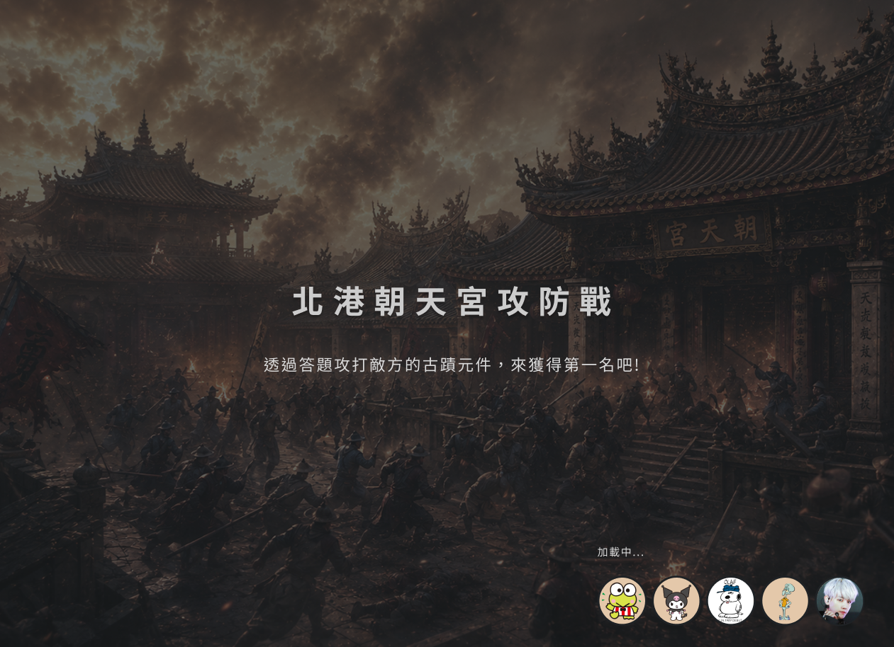
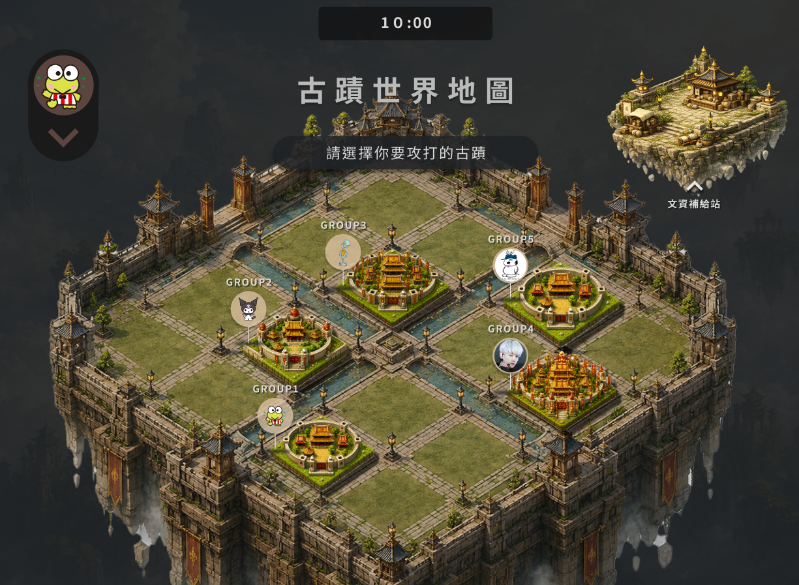
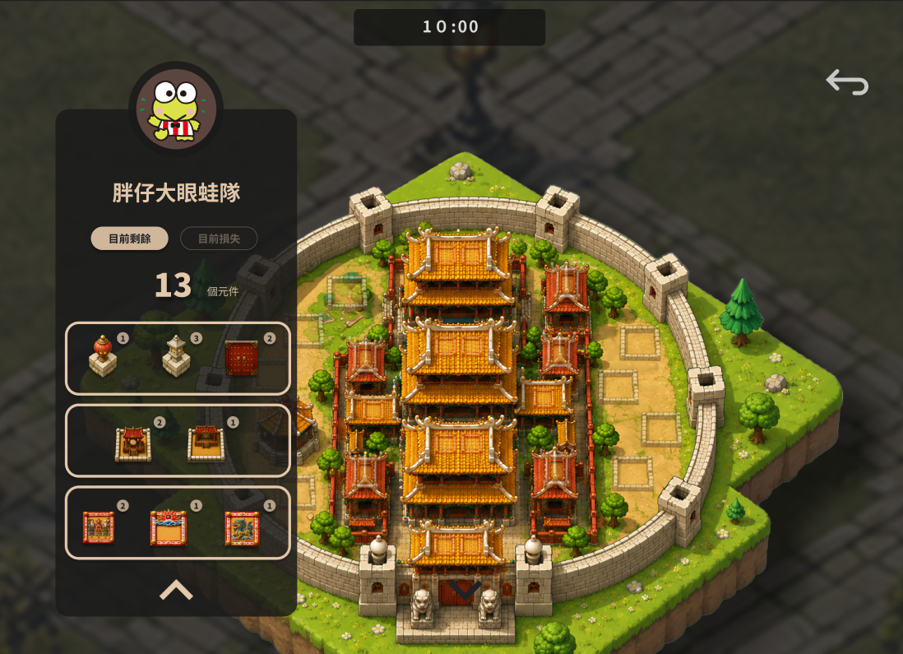
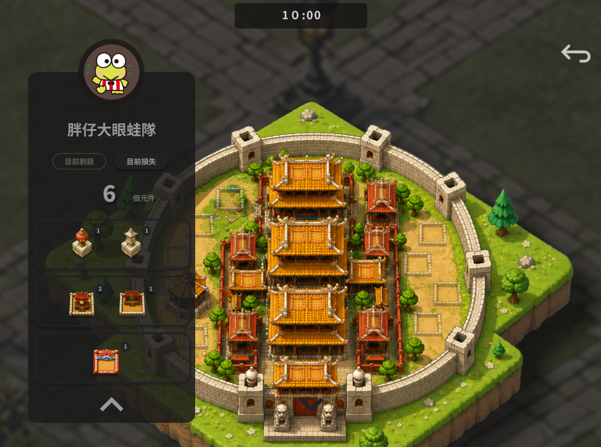
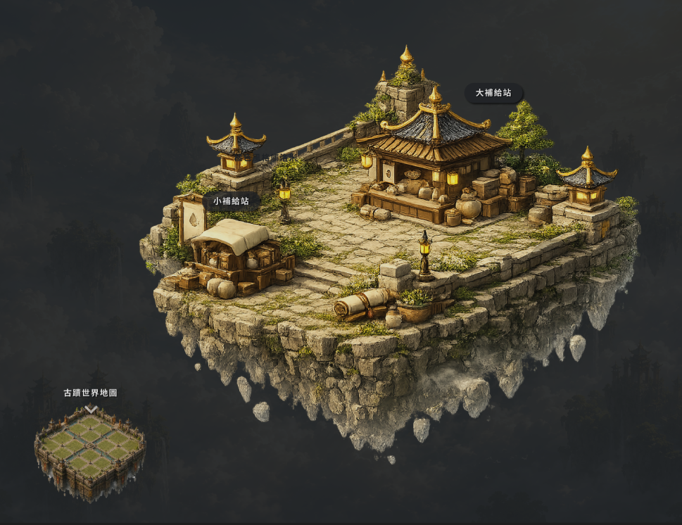
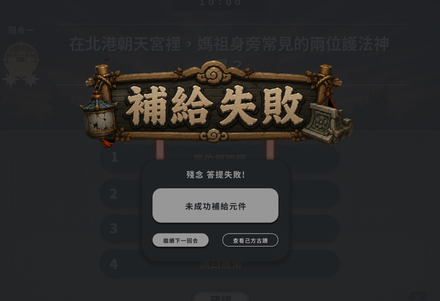
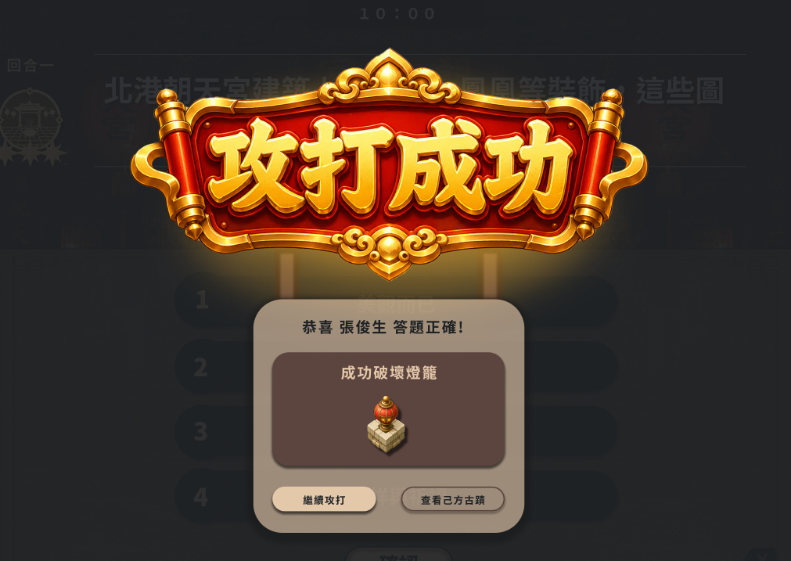

## 1. loading 介面
進去攻防戰會先進入載入介面(參考:)，背景用暗一點，圖片是 assets/heritages/{heritage_name}/fight.png，中間顯示半透明黑底橫幅，大標"北港朝天宮攻防戰"，小標"透過答題攻打敵方的古蹟部件，來獲得第一名吧"，右下角會有載入的loading轉圈動畫，以及小組頭像一橫排，頭像之間些微重疊，由左到右圖層為上->下(最多顯示4個，超過的在最上層顯示一個半透明黑的頭像大小的圓形，中間寫+X，代表還有幾個沒顯示出來)

這時候請幫我把後續會重複出現與需要fetch的資料等都載入好

## 2. 古蹟世界地圖介面
參考圖片: 
這個古蹟世界地圖和古蹟檢視頁面一樣是可以拖曳放大縮小的，這裡會顯示各組的剩餘的 剩餘血量/該組上限，各組的古蹟狀況會即時更新在地圖上，如果今天有人被打或是有人修補了原料，ws會即時通知，我們要再向server fetch資料，地圖的圖片是 assets/images/fight_map.png ，自己組別的古蹟用 assets/heritages/{heritage_name}/main.png，別人的用enemy.png，要把各組的原料狀況都同步顯示在這個世界地圖上，畫面上方會顯示剩餘攻防時間

### 主島嶼
這個地圖會有共16格顯示所有組別的古蹟，必須顯示各組的頭項與小組名字(display_name)的氣泡在組別的古蹟左方，這個氣泡要注意不能夠過大，我希望在放大時要保持氣泡大小一致，有點類似google map上的地標，縮太小會消失，放大會維持原來大小，這邊會有提示說 "請選擇要查看的古蹟"

#### 點選他人島嶼或頭像
放大該島嶼，並顯示該組頭項與組名，右上角有返回按鈕，並提示可以攻擊的部件(用中慢速亮暗來表示可攻擊的地方)，提示資訊會變成 "請選擇要攻擊的部位"，點了會再次放大，顯示部件名稱、題目難度等資訊，並詢問是否要攻擊該部件(這邊跟編輯古蹟中確認是否拆除部件的動畫一樣，亮暗highlight要比 "顯示可攻擊部件" 亮暗的速度快一點)

#### 點選自己組
放大島嶼，顯示自己組的頭像與組名，另外要可以顯示目前剩餘的部件有哪些、剩幾個，以及目前損毀的有哪些、剩幾個，參考:  

### 補給島
世界的右上角也會有一個補給站的島嶼，圖片:assets/images/supply_station.png，點了會縮小攻防島嶼，放大補給站(要有這個轉換動畫) 參考圖片:，縮小的主島在左下角，點了會返回(動畫方式一樣)

#### 修復已損元件
補給島會顯示按鈕 "修復已損壞元件"，點了之後會列出自己組目前已損的元件，點選之後會根據該元件的難度向後端取得新的對應難度的題目，若補給成功就會重新修復該元件，題目應該會被替換成這個補給的題目，失敗則沒有任何效果

### 左上角選單
左上角的按鈕選單會改成只有 "自己古蹟" 與 "文資補給站"，btn icon別為 assets/icons/buttons/my_heritages_btn.png 和 assets/icons/buttons/supply_station_btn.png，點了自己古蹟 = 在地圖上點自己古蹟，點了文資補給站 = 點及右上角的補給島

### 成功或失敗的攻打、補給、採集
在這些操作成功或失敗都會有對應的icon與介面，介面的圖片在 assets/icons/{action}_{fail or succesful}.png，參考介面: 

## 3. 時間到
時間到與採集資源一樣要顯示 times_up.png，下方有 "查看排行榜" 按鈕，這時候後端會算好結果，我們把最終結果顯示在畫面上即可，請做得好看一點，排行榜要顯示 名次、組別頭像、組別名字、剩餘血量，右下角有結束遊戲得按鈕，按了會先確認是否要離開，離開後會回到選擇古蹟頁面

## 4.攻防階段的即時通知
當自己組的元件被打成功要顯示哪組攻破了我們的什麼元件，這個通知是APP內的，不要做成系統通知

注意事項:
1. 同時打一題，先搶先贏，ws通知發現正在打的題目被打了要跳掉
2. 原料綁定題目，修復會換題目(換成修復回答的題目)
3. 打失敗直到改題目前都不能再打
4. 攻防戰階段只有古蹟簡介與攻防戰按鈕enable，其他按鈕都是disable
5. web socket 會發訊號說有狀態更新，我們就要向後端取得目前的所有組別的狀態，然後即時更新