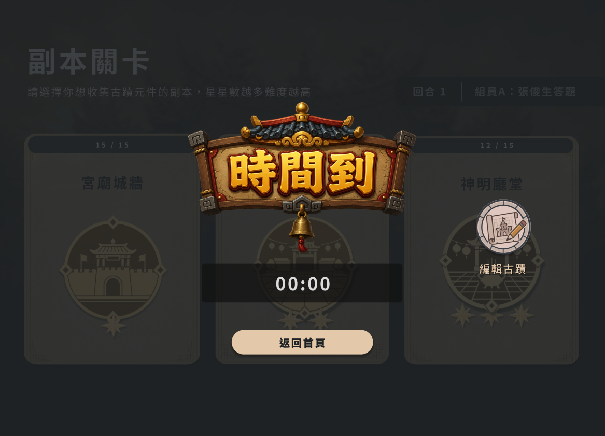
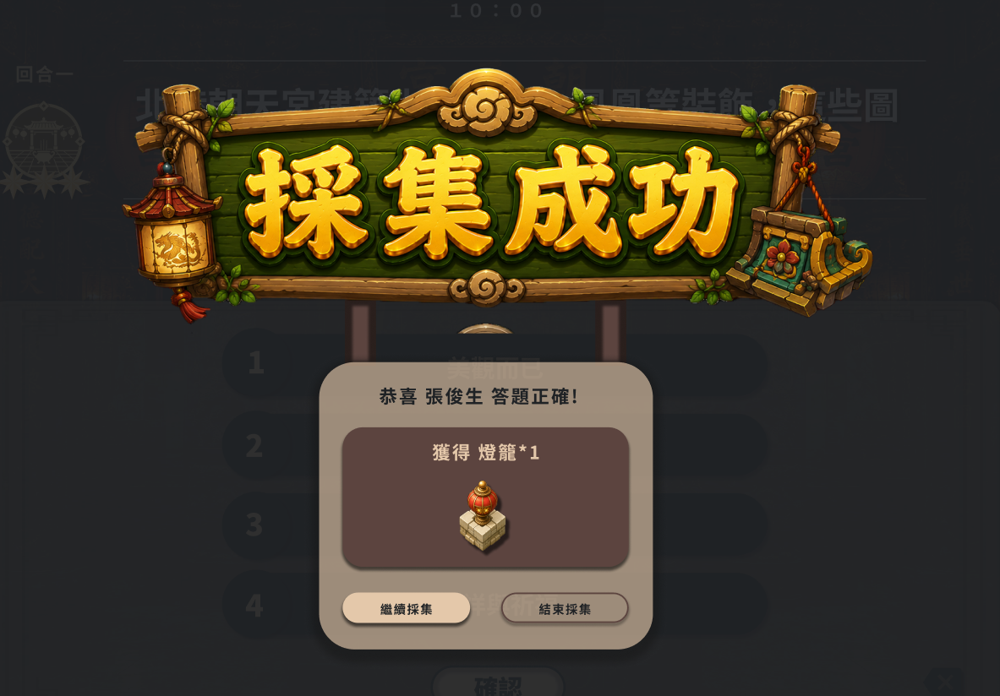

1. 採集時間到應該要是背景變暗，然後前往編輯按鈕放在"時間到"右側，回首頁置中對其放在"時間到"下方
2. 選擇難度的"區域icon"改小一點點
3. 採集成功/失敗、攻防戰攻打成功/失敗統一改成此風格的樣貌，相關圖片assets/icons裡面有 attack_successful.png、attack_fail.png、collect_successful.png、collect_successful.png