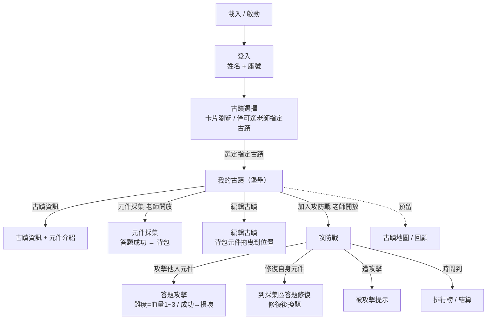

# G-BOOKS 蹟不可師 — 頁面與流程 (PAGES)

> 本文件依 `APP_figma/`（Figma 匯出畫面）整理，並交叉參考 `gb_api/`（後端 API）與 `data/`、`data2/`（美術素材）。已併入需求方確認後的細節，作為**前端建構規格**。
>
> **狀態標記**
> - ✅ 已確認，前端優先實作
> - 🟡 已確認，但細節 / 素材待補
> - ⬜ 預留（先不實作，保留入口或路由）
>
> **裝置**：以平板（iPad Pro 12.9"）為主，需相容響應式。
> **本階段策略**：先以 **mock 資料**把前端流程做出來，API 之後再串；後端缺漏再與後端工程師協調。

---

## Figma 檔案對應

| 畫面 | 對應檔案 |
|---|---|
| 載入 / 啟動 | `APP_figma/登入頁面與主畫面/ipad-pro-12-9-1.html` |
| 登入（姓名 + 座號） | `APP_figma/登入頁面與主畫面/ipad-pro-12-9-2.html` |
| 古蹟堡壘 / 古蹟選擇 | `APP_figma/遊戲流程/page.html` |
| 組別角色（小組古蹟） | `APP_figma/小組古蹟/page.html` |
| 答題回合 | `APP_figma/遊戲流程/2.html` |
| 戰鬥／答題場景 | `APP_figma/遊戲流程/1.html` |
| 了解古蹟 · 元件介紹（燈籠） | `APP_figma/遊戲流程/frame-1.html`、`frame-2.html` |
| 被攻擊提示 | `APP_figma/遊戲流程/frame-24.html` |

---

## 遊戲概念
「蹟不可師」是以**台灣古蹟（示範：北港朝天宮）**為主題的分組教育遊戲。學生分組經營一座古蹟堡壘：先**了解古蹟與元件**、在老師開放時段**採集元件**並**編輯（修復／佈置）古蹟**，並於**攻防戰**互相攻擊 / 修復元件，時間到後以**排行榜**結算。

## 角色

| 角色 | role | 權限重點 |
|---|---|---|
| 學生 Student | 0 | 經營堡壘；採集 / 攻防需老師開放才能操作 |
| 老師 Teacher | 1 | 指定當堂古蹟、開放採集 / 攻防、控制節奏（**本階段先預留，不實作**） |
| 管理員 Admin | 2 | 系統管理 |

> **老師端**：本階段**先不實作，但保留路由與資料結構**（遊戲階段切換以前端 mock 開關模擬）。

## 關鍵規則（需求方已確認）
1. **元件採集**與**攻防戰**需老師開啟才可點選，其餘時間為 **disabled**。
2. 元件採集成功 → 元件進入**背包**；於**編輯古蹟**可把背包元件**拖曳**到古蹟對應位置。
3. **古蹟選擇**可瀏覽其他古蹟（卡片拖動），但每堂課老師只指定**一個**古蹟可進入教學；其餘古蹟呈「**預備解鎖**」狀態，需該堂課結束才解鎖。選定古蹟後才進入「我的古蹟」。
4. **了解古蹟**＝古蹟各項資訊 + 元件介紹（元件與古蹟某部位關聯，例：城牆、內部物件）。
5. **攻防戰**：
   - 攻擊：限時內攻擊**他人**元件；題目越難、血量越高（1～3）；攻擊成功 → 該元件變**損壞**狀態（圖會變）；攻擊失敗 → 在該元件**未更換題目前**無法再次攻擊。
   - 修復（即「防禦」）：到老師的**採集區**回答**對應難度**題目以修復已損毀元件；修復後該元件**附加的題目會更換**。
6. **古蹟地圖**：尚未設計，**先預留**（用於回顧之前玩過的古蹟）。
7. **排行榜 / 結算**：於**攻防戰時間到**時結算。
8. **小組名稱**：命名規則與儲存由需求方再與後端協調（前端先保留欄位與顯示）。

---

## 整體流程

---

## 1. 載入 / 啟動 ✅
- 顯示 G-BOOKS 蹟不可師 Logo 與載入進度。
- 完成後進入登入頁。

## 2. 登入 ✅
**來源**：`登入頁面與主畫面/ipad-pro-12-9-2`（羊皮紙底、置中 Logo、底部古蹟剪影）

- 欄位：**姓名**（請輸入姓名）、**座號**（請輸入座號）。
- 「登入」→ 進入古蹟選擇。
- 角色判定（學生 / 老師）之後串 API；本階段預設學生。

> ⚠️ 與後端目前 `username/password` 不同（後端登入欄位待協調）。

## 3. 古蹟選擇 ✅
**來源**：`遊戲流程/page.html`

- 卡片輪播 / 拖動瀏覽多座古蹟。
- 只有**老師當堂指定**的古蹟可選，其餘顯示**鎖定 / 預備解鎖**（可看不可進）。
- 顯示選中古蹟背景與簡介。
- 選定指定古蹟 → 進入「我的古蹟」。

## 4. 我的古蹟（堡壘）✅
**來源**：`遊戲流程/page.html`、`小組古蹟/page.html`

- 顯示小組名稱、組別吉祥角色、古蹟堡壘場景（含已佈置元件）。
- **左側 4 個功能按鈕**：
  1. **古蹟資訊** → §5
  2. **加入攻防戰**（老師開放才 enabled）→ §8
  3. **元件採集**（老師開放才 enabled）→ §6
  4. **編輯古蹟** → §7
- 遭攻擊時彈出**被攻擊提示**（`frame-24`）。

## 5. 古蹟資訊（了解古蹟）✅
**來源**：`遊戲流程/frame-1`、`frame-2`；素材 `data2/temple intro`、`Item Intro`、`heritage items`

- 古蹟基本資訊（名稱、年代、位置、簡介等）。
- **元件介紹**：每個元件對應古蹟某部位（城牆 / 內部物件…），含名稱、圖、說明（例：燈籠）。

## 6. 元件採集 ✅（老師開放才可操作）
**來源**：`gb_api` question + state；素材 `data/採集*`、`data2/heritage items`

- 入口在非開放時為 **disabled**。
- 開放時：抽題作答（`question/generate` → `question/answer`）。
- 答對 → 取得對應元件，放入**背包**（庫存）。

## 7. 編輯古蹟 ✅
**來源**：素材 `data2/building ui/self heritage`、`ui frame`

- 顯示古蹟可放置**位置（slots）**與**背包**元件。
- 將背包元件**拖曳**到對應位置完成佈置 / 修復（對應 `item/inv2slot`、`item/slot2inv`）。

## 8. 攻防戰 ✅（老師開放才可操作）
**來源**：素材 `data/attack`、`data/defend_component`（easy/medium/difficult）、`frame-24`；`gb_api` item/question/state

**8.1 攻擊**
- 限時內選擇攻擊**他組**元件。
- 題目難度決定該元件血量（1～3）。
- 答對 → 攻擊成功，元件變**損壞**（圖切換為損壞圖）。
- 答錯 → 攻擊失敗，在該元件**未換題前**不可再攻擊同一元件。

**8.2 修復（防禦）**
- 到老師**採集區**回答**對應難度**題目，修復自身**損壞**元件。
- 修復成功 → 元件復原；該元件**附加題目更換**。

**8.3 被攻擊提示**
- 自身古蹟遭攻擊時跳出「我的古蹟正在被攻擊」。

## 9. 排行榜 / 結算 🟡
**來源**：素材 `times-up-1`、`ranking-1`、`rankf1~3`

- **攻防戰時間到**自動結算。
- 顯示各組名次 / 分數（計分規則待定）。

## 10. 古蹟地圖 ⬜（預留）
**來源**：素材 `data/heritagemap`、`data2/building ui/heritage map`

- 尚未設計；前端**保留入口 / 路由**，供日後回顧已玩古蹟。

## 11. 老師介面 ⬜（預留，先不實作）
- 指定當堂古蹟、開放 / 關閉採集與攻防、控制節奏、結算。
- 前端保留路由與狀態切換掛點（本階段以開發用開關模擬遊戲階段）。

---

## 待協調 / 待補
1. 登入欄位（姓名 + 座號）與後端 `username/password` 的對應。
2. 小組名稱的儲存方式（後端目前無欄位）。
3. 排行榜計分規則。
4. 古蹟地圖實際內容與互動。
5. 元件 ↔ 古蹟部位、題目難度 ↔ 血量、損壞 / 復原圖的素材對應表。
